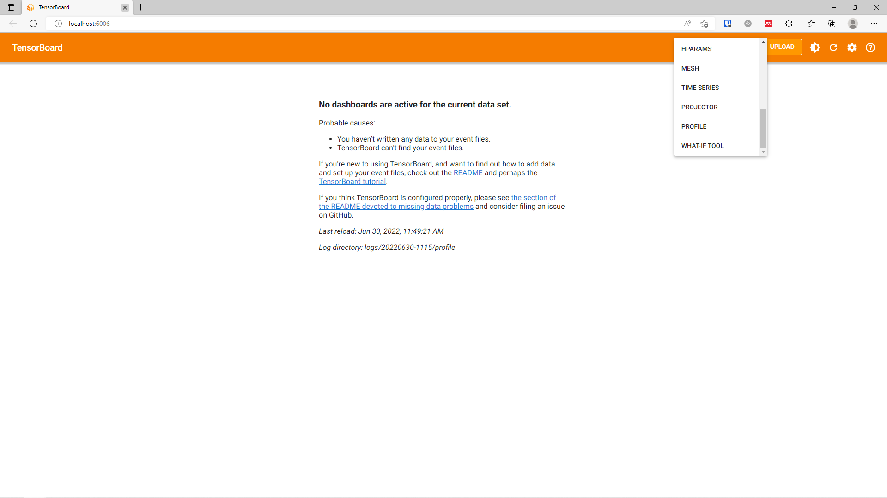

# Machine Learning Accelerated Tomographic Reconstruction for Multispectral Imaging on TCV

This package contains code to reproduce results for the machine learning based tomographic reconstruction.
First clone the repository to your machine, and create a virtual environment (and activate the venv).
```shell
python -m venv venv

(WINDOWS) venv\Scripts\activate{.bat, .ps1}
(UNIX) source venv/bin/activate
```

Then install the required packages, and the code of this project (or used the requirements-lock.txt):
```shell
pip install -r requirements.txt
pip install -e .
```

To get started with this project you need one additional data file: the geometry matrix.
Copy the geometry matrix for a specific shot to `./data/utils/geometry_matrices/{geometry_id}.npz`.

Now you can run the tutorials in the `notebooks` directory, or use the command line interface.
To get started with the command line interface generate some data with:
```shell
python cli.py generate-dataset {geometry_id} {number_of_training_samples}
```

Then you can edit the `config.yaml` file as you wish, but the default one in the repository should work as well.
To train a model with the parameters defined in the configuration file, simply run
```shell
python cli.py train
```
or when using a different configuration file use (with ? indicating an optional parameter)
```shell
python cli.py train {?your_configuration_file.yaml}
```

You can find a geometry matrix for shot number 65903 on [this google drive](https://drive.google.com/drive/folders/1hxuSuCPjPOhwNOfia9q8m1M7VJkKuTa1?usp=sharing).


## Reproduction
The code in this repository is very similar to the code used to generate the figures and results in the halfway paper.
Configurations that should yield similar results for both the informed U-net and the deep unfolded network can both be found in the
`configurations` directory. 25000 training samples had been generated for the training.

You can evaluate the MSE and MAE of a trained model as:
```shell
python cli.py evaluate {training/model_id}
```
where the `{training/model_id}` can be found in the `logs` or `models` folder, being a datetime string. The training of 
the informed U-net is generally stable and easily reproducible. The training of the unfolded network generally isn't 
and multiple runs might be needed to get a satisfactory result.

You can analyse the inference time by starting tensorboard in `logs/{model_id}/profile` and then selecting
the Profile tab in the top bar:
```shell
tensorboard --logdir=logs/{model_id}/profile
```
<p align="middle">
    
    
</p>

We can get the same metrics for the SIRT algorithm as
```shell
python cli.py evaluate-sirt {config_path}
```
A default configuration file for the sirt algorithm can be found in `configurations/base_sirt_config.yaml`, resulting in:
```shell
python cli.py evaluate-sirt configurations/base_sirt_config.yaml
```

